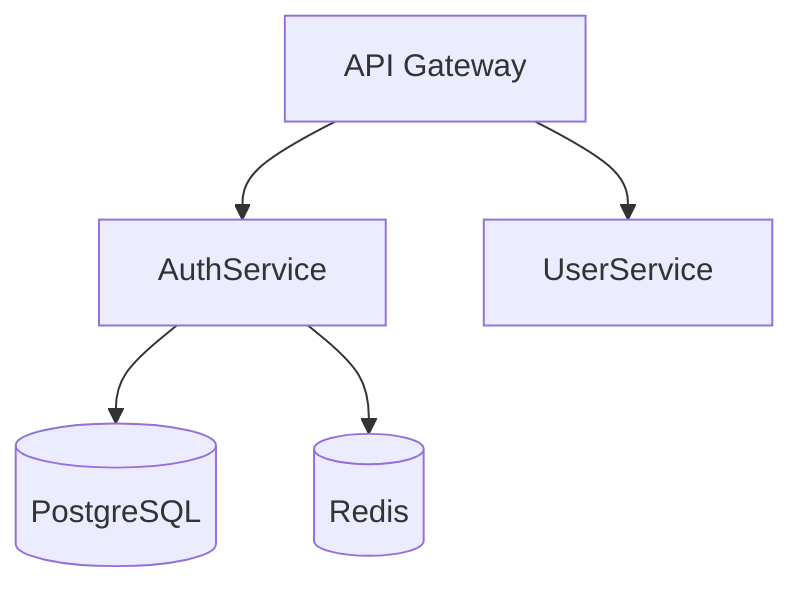

# Claude Virtual Company

A skill framework for AI coding assistants (Claude Code & Gemini CLI) that simulates a hierarchical software development company. You act as the CEO, delegating work through a structured engineering organization with proper governance, quality gates, and dynamic specialist hiring.

## Supported Providers

| Provider | Status | Task Management | Parallel Execution |
|----------|--------|-----------------|-------------------|
| **Claude Code** | ✅ Full Support | Native | ✅ Native |
| **Gemini CLI** | ✅ Full Support | MCP Server | Sequential |

Both providers share the same `.company/` state directory, so you can switch between them seamlessly.

## Features

- **Multi-Provider Support**: Works with both Claude Code and Gemini CLI
- **Hierarchical Role System**: CTO, Architect, Tech Lead, Senior Dev, Developer, QA
- **Dynamic Specialist Hiring**: Automatically creates specialists based on project needs
- **Proposal-Based Governance**: Cross-role actions require approval
- **Quality Gates**: Mandatory testing, code review, and acceptance criteria
- **Design Pattern Enforcement**: Architect selects patterns, roles follow consistently
- **Git Flow Integration**: Built-in branching strategy and PR workflows
- **Task Dependency Tracking**: Manage complex work with dependencies (MCP server for Gemini)
- **Fresh Context Windows**: Each role operates in isolation with explicit handoffs
- **GSD-Inspired Project Management**: Phase-based workflow with discuss→plan→execute→verify cycles
- **State Persistence**: Pause and resume work across sessions with full context
- **Automatic Context Management**: Tiered document loading, context decay, and archival to prevent bloat
- **Shared State**: Switch between providers seamlessly with persistent workflow state

## Quick Start

### Installation

```bash
# Install for both Claude Code and Gemini CLI (default)
npx claude-virtual-company init

# Install for Claude Code only
npx claude-virtual-company init --provider claude

# Install for Gemini CLI only
npx claude-virtual-company init --provider gemini

# Install globally
npx claude-virtual-company init --global
```

### Start a Project

**Claude Code:**
```bash
claude
/company "Build a user authentication system with email/password login"
```

**Gemini CLI:**
```bash
gemini
/company "Build a user authentication system with email/password login"
```

3. The orchestrator will:
   - Evaluate expertise needs and hire specialists
   - Create a feature branch
   - Guide work through the hierarchy
   - Ensure quality at each phase

### Check Status

```
/company-status
```

### Merge When Complete

```
/company-merge
```

## How It Works

### The Hierarchy

```
┌─────────────────────────────────────────────────────────────────┐
│                         CEO (You)                                │
│                    Provides Vision/Goal                          │
└─────────────────────────────────────────────────────────────────┘
                              │
                              ▼
┌─────────────────────────────────────────────────────────────────┐
│                    /company Orchestrator                         │
│              (Manages workflow, tracks state)                    │
└─────────────────────────────────────────────────────────────────┘
        │           │           │           │           │
        ▼           ▼           ▼           ▼           ▼
    ┌───────┐   ┌───────┐   ┌───────┐   ┌───────┐   ┌───────┐
    │  CTO  │──▶│ Arch  │──▶│ Lead  │──▶│ Dev   │──▶│  QA   │
    └───────┘   └───────┘   └───────┘   └───────┘   └───────┘
        │           │           │           │           │
        ▼           ▼           ▼           ▼           ▼
    [Strategy] [Design]    [Plan]     [Code]    [Verified]
```

### Workflow Phases

1. **Expertise Assessment**: Hiring manager evaluates what specialists are needed
2. **Architecture (CTO)**: Technical strategy and technology decisions
3. **Design (Architect)**: Component design, API contracts, data models
4. **Planning (Tech Lead)**: Feature breakdown, task creation, dependency mapping
5. **Implementation (Developer)**: Code implementation with tests
6. **Review (Code Reviewer)**: Quality, security, and standards check
7. **Verification (QA)**: Comprehensive testing and validation
8. **Merge**: PR creation and merge to main

### Quality Gates

Each phase transition requires:
- Completed artifacts in `.company/artifacts/[role]/`
- Handoff document with acceptance criteria
- Passing verification commands
- No blocking issues

### Project Manager Workflow (GSD-Inspired)

For larger projects, use the full PM workflow:

```
/company-new-project "Build a task management app"
```

This initiates a structured cycle:

1. **Discuss** - Capture implementation preferences and resolve gray areas
2. **Plan** - Create atomic tasks (max 2-3 per plan) with XML format
3. **Execute** - Parallel wave execution with atomic commits
4. **Verify** - Automated checks + User Acceptance Testing

Each phase produces artifacts in `.planning/phase-{N}/`:
- `CONTEXT.md` - Decisions from discuss phase
- `{N}-PLAN.md` - Executable task plans
- `{N}-SUMMARY.md` - Completion records
- `VERIFICATION.md` - Test results
- `UAT.md` - User acceptance confirmation

Use `/company-progress` to see current state and recommended next action.

Use `/company-quick "task"` for ad-hoc work without full ceremony.

## Commands

### Core Commands

| Command | Description |
|---------|-------------|
| `/company [goal]` | Start a new project |
| `/company-status` | Check workflow state |
| `/company-settings [path] [value]` | View/modify configuration |
| `/company-merge [branch]` | Merge to main with validation |
| `/company-roster` | View specialists |
| `/company-hire [domain]` | Request new specialist |
| `/company-propose [type]` | Submit a proposal |

### Project Manager Commands (GSD-Inspired)

| Command | Description |
|---------|-------------|
| `/company-new-project` | Start new project with roadmap |
| `/company-progress` | Check progress, route to next action |
| `/company-discuss [N]` | Capture phase requirements |
| `/company-plan-phase [N]` | Create executable plans |
| `/company-execute [N]` | Execute plans with parallel waves |
| `/company-verify [N]` | Verify phase completion + UAT |
| `/company-quick [task]` | Quick mode for ad-hoc tasks |
| `/company-pause` | Create context handoff |
| `/company-resume` | Resume from previous session |
| `/company-milestone` | Complete and archive milestone |

## Configuration

Configuration is stored in `.company/config.json`. Key settings:

### Model Settings

Configure which Claude model to use for each role. More capable models (opus) are used for strategic roles, while faster models (sonnet/haiku) handle implementation tasks.

```json
{
  "company": {
    "models": {
      "cto": "opus",
      "architect": "opus",
      "tech-lead": "opus",
      "developer": "sonnet",
      "senior-dev": "sonnet",
      "code-reviewer": "sonnet",
      "qa": "opus",
      "hiring-manager": "haiku"
    }
  }
}
```

Available models: `opus`, `sonnet`, `haiku`

Modify model for a role:

```
/company-settings company.models.developer haiku
```

### Quality Settings

```json
{
  "quality": {
    "test_coverage_minimum": 80,
    "require_tests": {
      "unit": "required",
      "integration": "required",
      "e2e": "required_for_user_flows",
      "ui": "required_for_frontend"
    },
    "require_code_review": true
  }
}
```

### Design Patterns

The framework encourages consistent, maintainable code through design pattern enforcement:

**Role Responsibilities**:
- **Architect** selects patterns and documents in `component-design.md`
- **Tech Lead** references patterns in feature specs
- **Developer** implements following specified patterns

**Common Patterns Used**:

| Pattern | Purpose |
|---------|---------|
| Repository | Abstract data access |
| Service Layer | Encapsulate business logic |
| Controller + DTO | Clean HTTP handling |
| Middleware | Cross-cutting concerns |
| Factory | Complex object creation |

**File Organization** (typical):
```
src/
├── controllers/    # HTTP handlers
├── services/       # Business logic
├── repositories/   # Data access
├── models/         # Domain entities
└── middleware/     # Auth, logging, etc.
```

This prevents "god files" and spaghetti code by enforcing separation of concerns.

### Git Flow Settings

```json
{
  "git_flow": {
    "strategy": "gitflow",
    "require_pr": true,
    "squash_on_merge": true
  }
}
```

### Hiring Settings

```json
{
  "hiring": {
    "auto_hire": true,
    "require_ceo_approval_for_new_roles": false,
    "expertise_evaluation": {
      "on_project_init": true,
      "on_escalation": true,
      "self_evaluation_enabled": true
    }
  }
}
```

Modify settings:

```
/company-settings quality.test_coverage_minimum 90
```

## Specialists

### Default Specialists

- **Git Flow**: Branching strategy, commit conventions, PR workflows
- **Code Reviewer**: Code quality, security, best practices
- **Test Architect**: Testing strategy, unit/integration/E2E

### Available Domains

The hiring manager can create specialists for:

- **Frontend**: React, Vue, Angular, Svelte, CSS, Accessibility
- **Backend**: Node.js, Python, Go, Rust, Java, .NET
- **Database**: PostgreSQL, MongoDB, Redis
- **Infrastructure**: Docker, Kubernetes, AWS, GCP
- **Testing**: Unit, Integration, E2E, Visual
- **Security**: Application security, Authentication

### Manual Hiring

```
/company-hire frontend-react
```

## Governance

### Proposal System

Cross-role actions require proposals:

| Action | Auto-Approve | Needs Review | Needs CEO |
|--------|--------------|--------------|-----------|
| Create own subtask | ✅ | | |
| Developer → QA task | ✅ | | |
| Cross-role task | | ✅ | |
| Reject handoff | | ✅ | |
| Scope change | | | ✅ |
| Block release | | | ✅ |

### Escalation

Issues are escalated based on severity:
- **Low**: Orchestrator resolves
- **Medium**: Senior role consulted
- **High**: CEO notified
- **Blocking**: Immediate CEO decision

## Project Structure

After installation:

```
# Claude Code skills
.claude/
└── skills/
    ├── company/              # Main orchestrator
    ├── company-protocols/    # Shared standards
    ├── company-git-flow/     # Git expertise
    ├── company-[role]/       # Role skills
    └── company-specialists/  # Dynamic specialists

# Gemini CLI configuration
.gemini/
├── context/                 # Role context files (transpiled from SKILL.md)
│   ├── company.md
│   ├── company-cto.md
│   └── ...
├── commands/company/        # TOML command definitions
│   ├── company.toml
│   └── ...
└── settings.json            # MCP server configuration

GEMINI.md                    # Project context for Gemini (root level)

# Shared state (used by both providers)
.company/
├── config.json              # Configuration
├── roster.json              # Specialists roster
├── state.json               # Workflow state
├── tasks/                   # Task storage (MCP server)
│   ├── index.json
│   └── task-*.json
├── proposals/               # Pending/approved/rejected
├── artifacts/               # Role outputs
└── inboxes/                 # Role communication

.planning/                   # Project Manager (GSD-inspired)
├── config.json              # PM configuration
├── PROJECT.md               # Vision and objectives
├── REQUIREMENTS.md          # Scoped requirements
├── ROADMAP.md               # Phase breakdown
├── STATE.md                 # Session state and decisions
├── phase-{N}/               # Phase artifacts
│   ├── CONTEXT.md           # Phase decisions
│   ├── {N}-PLAN.md          # Executable plans
│   ├── {N}-SUMMARY.md       # Completion summaries
│   └── VERIFICATION.md      # Verification results
└── quick/                   # Ad-hoc task tracking
```

## Provider Differences

### Claude Code vs Gemini CLI

| Feature | Claude Code | Gemini CLI |
|---------|-------------|------------|
| Context isolation | Native (`context: fork`) | Sequential with file handoffs |
| Parallel execution | Native (background tasks) | Sequential only |
| Task management | Native tools | MCP server |
| Tool restrictions | Enforced (`allowed-tools`) | Trust-based guidance |
| Per-role model selection | ✅ Supported | ❌ Not supported |
| Hooks | Native support | Not supported |
| Dynamic context | Backtick syntax | Pre-loaded context files |

**Note:** The model configuration in `.company/config.json` (opus/sonnet/haiku per role) only applies to Claude Code. Gemini CLI uses your globally configured model for all roles.

### MCP Task Server

For Gemini CLI, task management is provided via an MCP (Model Context Protocol) server that exposes these tools:

- `cvc_task_create` - Create a new task
- `cvc_task_list` - List all tasks
- `cvc_task_get` - Get task details
- `cvc_task_update` - Update task status

Tasks are stored in `.company/tasks/` and work with both providers.

### Switching Providers

Both providers share the same `.company/` state directory. You can:

1. Start work in Claude Code
2. Continue in Gemini CLI
3. Switch back anytime

The workflow state, artifacts, and tasks persist across provider switches.

For detailed information, see:
- [docs/PROVIDER-COMPARISON.md](docs/PROVIDER-COMPARISON.md) - Feature comparison matrix
- [docs/GEMINI-SETUP.md](docs/GEMINI-SETUP.md) - Gemini CLI setup guide

## Best Practices

### For Best Results

1. **Clear Goals**: Provide specific, well-defined project goals
2. **Let It Work**: Allow the workflow to progress through phases
3. **Review Escalations**: Respond to CEO-level decisions promptly
4. **Check Status**: Use `/company-status` to monitor progress

### Customization

1. **Adjust Quality**: Set appropriate coverage and test requirements
2. **Configure Git**: Match your team's branching strategy
3. **Manage Specialists**: Add domain-specific expertise as needed

## Context Management

The framework includes automatic context management to keep Claude's context fresh and prevent bloat during long projects.

### Tiered Document Loading

Handoffs and artifacts use tier markers for progressive loading:

```markdown
<!-- TIER:SUMMARY -->
TL;DR in ~50 words - always loaded
<!-- /TIER:SUMMARY -->

<!-- TIER:DECISIONS -->
Acceptance criteria, verification commands, key constraints - loaded by default
<!-- /TIER:DECISIONS -->

<!-- TIER:FULL -->
Full rationale, alternatives considered - loaded only when blocked
<!-- /TIER:FULL -->
```

Each role skill automatically loads the appropriate tier (usually SUMMARY + DECISIONS) from upstream artifacts. If you need full context while working, run:

```bash
cat .company/artifacts/[role]/[file].md
```

### Automatic Context Decay

- **Session Log Trimming**: When `STATE.md` exceeds 500 lines, old session entries are archived to `.planning/archive/sessions/` and only the 10 most recent entries are kept
- **Milestone Archival**: When completing a milestone, all phase directories move to `.planning/archive/v{version}/`
- **Quick Task Cleanup**: Quick tasks older than 7 days are automatically archived
- **Proposal Archival**: Approved/rejected proposals older than 30 days are archived

### Configuration

Context management settings in `templates/pm-config.json`:

```json
{
  "context_management": {
    "session_log_max_entries": 25,
    "summarize_after_entries": 20,
    "archive_completed_phases": true,
    "handoff_max_lines": 100,
    "default_tier": "decisions",
    "quick_task_retention_days": 7
  }
}
```

### Platform Utilities

For programmatic context management, `src/platform.js` provides:

```javascript
const { readTier, trimSessionLog, archiveAndResetState } = require('./src/platform');

// Read specific tier from a tiered document
const decisions = readTier('.company/artifacts/architect/handoff.md', 'decisions');

// Trim session log keeping only recent entries
trimSessionLog('.planning/STATE.md', 10);

// Archive STATE.md and create fresh one for new milestone
archiveAndResetState('.planning/STATE.md', '.planning/archive/v1.0/');
```

### Mermaid Diagrams

Architect and Tech Lead roles use Mermaid diagrams to convey relationships efficiently. Claude reads the Mermaid source as structured text, making it effective for communicating:

| Diagram Type | Use Case |
|--------------|----------|
| `graph TD/LR` | Component relationships, service boundaries |
| `sequenceDiagram` | API flows, request/response patterns |
| `erDiagram` | Data model relationships |
| Dependency graphs | Task waves, parallel execution |

Example component diagram:



Guidelines:
- Keep diagrams small (5-10 nodes max)
- Place in DECISIONS tier for implementation context
- Use consistent naming across documents

### Writing Tiered Documents

When creating handoffs or key artifacts, structure them with tiers:

1. **SUMMARY tier**: One-liner decisions, tech choices, key constraints
2. **DECISIONS tier**: Acceptance criteria, verification commands, Mermaid diagrams
3. **FULL tier**: Rationale, alternatives considered, detailed context

This ensures downstream roles get exactly the context they need without loading historical rationale they don't.

## Windows Compatibility

The skill files (`.claude/skills/company*/SKILL.md`) contain bash commands that Claude executes. While the Node.js CLI (`cvc`) works on all platforms, the skill commands assume a Unix-like shell environment.

### Recommended Environments

For full compatibility on Windows, use one of these terminals:

- **Git Bash** (included with Git for Windows) - Recommended
- **WSL/WSL2** (Windows Subsystem for Linux)
- **PowerShell with Unix tools** (via chocolatey or scoop)

### Commands That May Need Alternatives

Some bash commands used in skill files have Windows equivalents:

| Bash Command | Purpose | Windows Alternative |
|--------------|---------|---------------------|
| `date -Iseconds` | ISO timestamp | Use `src/platform.js:getISOTimestamp()` |
| `tr \| sed \| cut` | String slugify | Use `src/platform.js:slugify()` |
| `cat file \|\| echo '{}'` | Safe JSON read | Use `src/platform.js:readJsonSafe()` |
| `mkdir -p` | Create nested dirs | Works in PowerShell 5+ |
| `find` / `ls` | File listing | Works in Git Bash |

### Cross-Platform Utilities

For programmatic use, the `src/platform.js` module provides cross-platform Node.js alternatives:

```javascript
const { getISOTimestamp, slugify, readJsonSafe } = require('./src/platform');

// Instead of: date -Iseconds
const timestamp = getISOTimestamp();

// Instead of: echo "$str" | tr ... | sed ... | cut ...
const branchName = slugify('My Feature Name', 40);

// Instead of: cat file.json 2>/dev/null || echo '{}'
const config = readJsonSafe('.company/config.json', {});
```

## Troubleshooting

### Workflow Stuck

1. Check `/company-status` for current state
2. Look for pending proposals in `.company/proposals/pending/`
3. Check role inboxes for blocked messages
4. Reset state if needed: `echo '{"phase":"idle"}' > .company/state.json`

### Tests Failing

1. Ensure test frameworks are installed
2. Check test configuration in `.company/config.json`
3. Review test output in QA artifacts

### Specialist Not Found

1. Check roster with `/company-roster`
2. Manually hire with `/company-hire [domain]`
3. Verify skill files exist in `.claude/skills/company-specialists/`

### Gemini CLI: MCP Server Not Working

1. Verify the server is configured in `.gemini/settings.json`
2. Check the path to the server is correct
3. Ensure Node.js 18+ is available
4. Test manually: `node node_modules/claude-virtual-company/mcp/task-server/index.js`

### Gemini CLI: Commands Not Found

1. Verify `.gemini/commands/company/` contains TOML files
2. Check TOML syntax is valid
3. Restart Gemini CLI after installation

### Check Installation Status

```bash
cvc status
```

This shows the installation status for both Claude Code and Gemini CLI.

## Contributing

Contributions are welcome! Please:

1. Fork the repository
2. Create a feature branch
3. Make your changes
4. Submit a pull request

## License

MIT License - see [LICENSE](LICENSE) for details.

## Acknowledgments

Built for [Claude Code](https://claude.ai/code) by Anthropic and [Gemini CLI](https://github.com/google-gemini/gemini-cli) by Google.

Uses:
- [Claude Code Agent Skills](https://docs.anthropic.com/en/docs/claude-code/skills) framework
- [Model Context Protocol (MCP)](https://modelcontextprotocol.io/) for cross-provider task management
- [Gemini CLI TOML Commands](https://geminicli.com/docs/cli/gemini-md/) for Gemini integration
