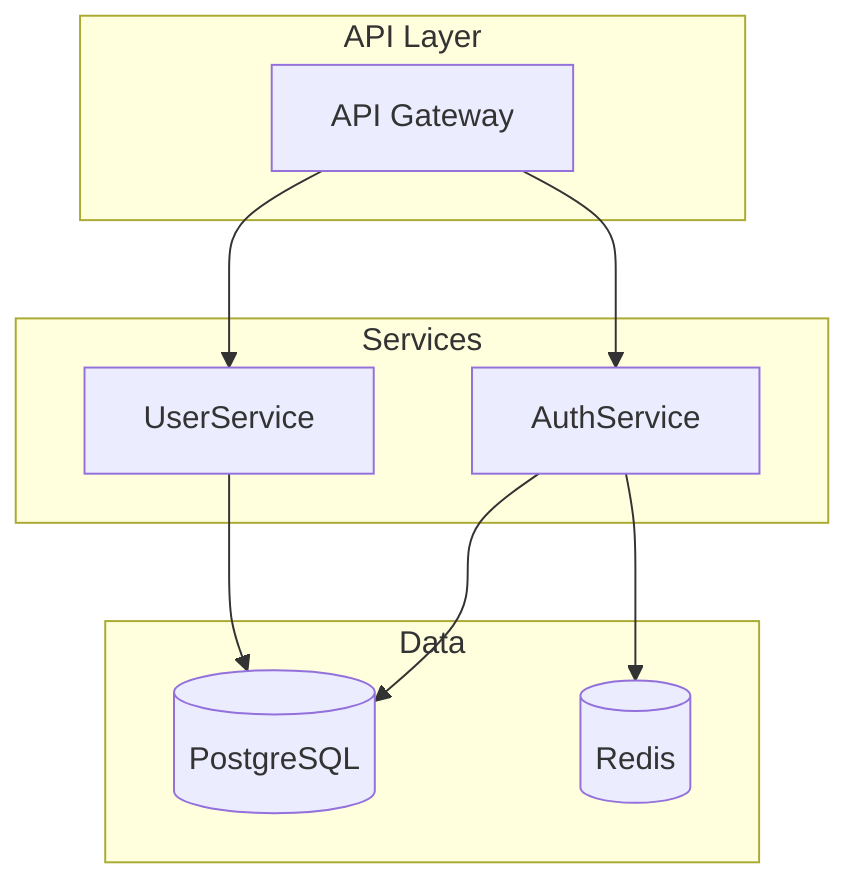
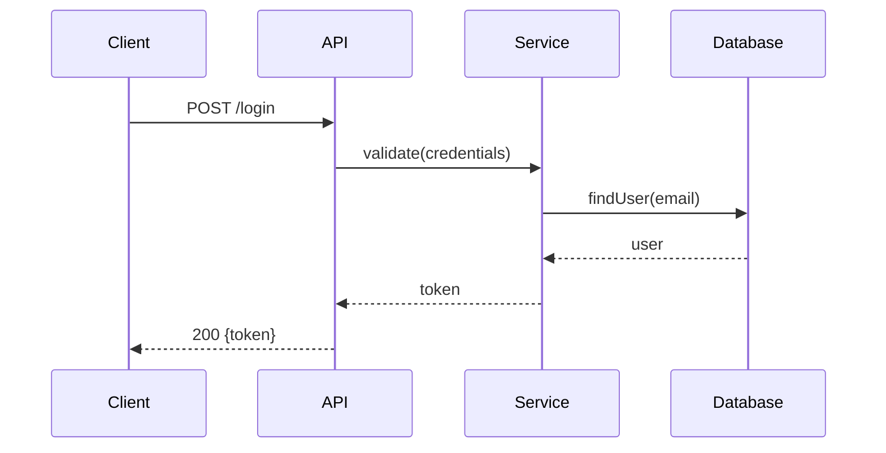
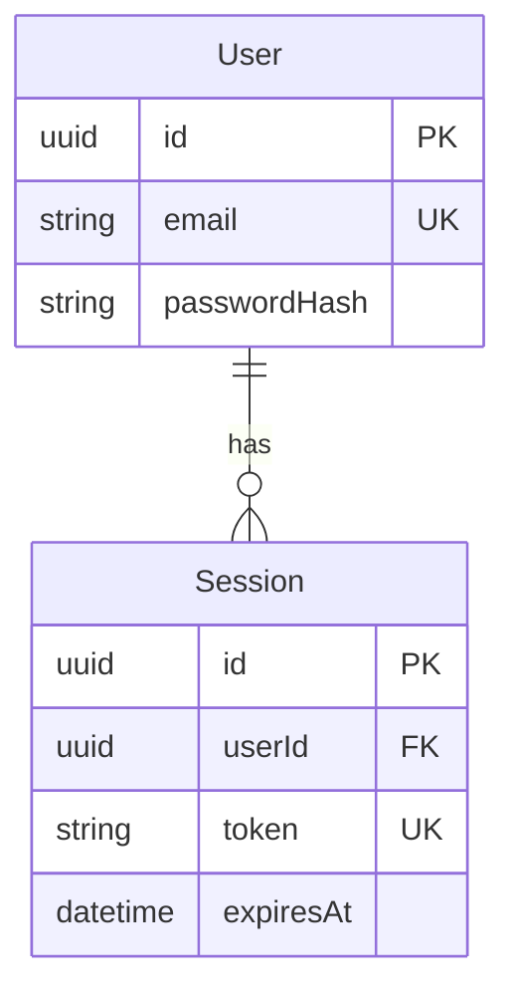
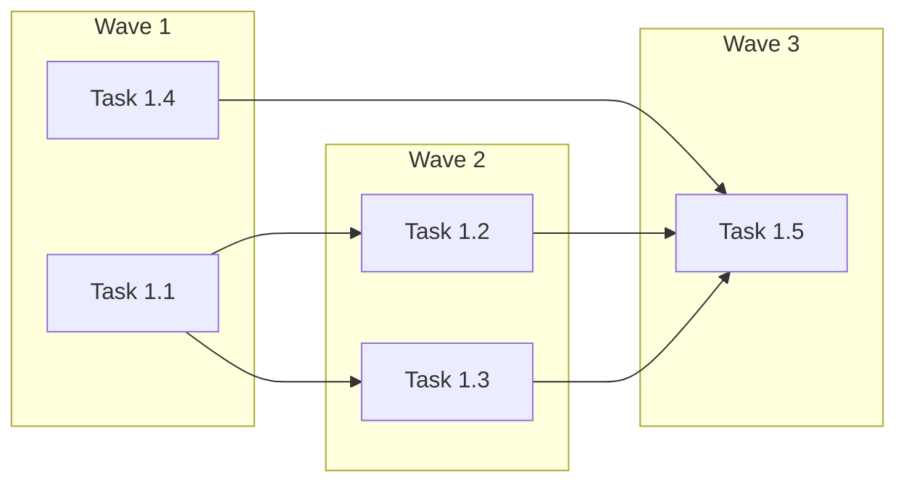

# Virtual Company Protocols

This skill defines shared standards that all roles must follow.

## Governance Matrix
!`cat .company/governance-matrix.json 2>/dev/null | head -100 || echo "Governance matrix not found"`

---

## Tiered Context Structure

All handoffs and key artifacts should use tier markers for progressive loading. This reduces context bloat while ensuring critical information is always available.

### Tier Markers

```markdown
<!-- TIER:SUMMARY --> ... <!-- /TIER:SUMMARY -->   (Always loaded, ~50 words)
<!-- TIER:DECISIONS --> ... <!-- /TIER:DECISIONS --> (Loaded for implementation)
<!-- TIER:FULL --> ... <!-- /TIER:FULL -->          (Loaded only if blocked)
```

### What Goes in Each Tier

| Tier | Content | When Loaded |
|------|---------|-------------|
| SUMMARY | TL;DR, one-line decisions | Always |
| DECISIONS | Acceptance criteria, verification, key constraints | Default |
| FULL | Rationale, alternatives, detailed context | On request |

### Example Tiered Handoff

```markdown
# Handoff: Architect → Tech Lead

<!-- TIER:SUMMARY -->
## Summary
REST API with JWT auth. 3 services: AuthService, UserService, SessionService.
PostgreSQL for persistence. Follow existing service patterns in src/services/.
<!-- /TIER:SUMMARY -->

<!-- TIER:DECISIONS -->
## Key Decisions
- JWT over sessions: stateless scaling
- Refresh tokens: 7-day expiry with rotation
- bcrypt cost factor: 12

## Acceptance Criteria
- [ ] Services created following existing patterns
- [ ] All endpoints documented in api-contracts.md
- [ ] Unit tests with 80%+ coverage

## Verification
\`\`\`bash
npm test -- --grep="Auth"
\`\`\`
<!-- /TIER:DECISIONS -->

<!-- TIER:FULL -->
## Alternatives Considered
[Full rationale...]

## Open Questions
[Deferred items...]
<!-- /TIER:FULL -->
```

---

## Mermaid Diagrams

Use Mermaid diagrams to convey relationships efficiently. Sub-agents read the Mermaid source as structured text, making it an effective way to communicate topology and flows.

### When to Use Mermaid

| Diagram Type | Use Case | Context Efficiency |
|--------------|----------|-------------------|
| `graph LR/TD` | Component relationships, service boundaries | High |
| `sequenceDiagram` | API flows, request/response patterns | High |
| `erDiagram` | Data model relationships | Medium |
| `flowchart` | Decision logic, state machines | Medium |

### When to Use Prose Instead

- Acceptance criteria (needs checkboxes)
- Verification commands (needs executable code)
- Rationale/decisions (narrative form)

### Guidelines

1. **Keep diagrams small** - 5-10 nodes maximum
2. **Place in DECISIONS tier** - relationships are key implementation context
3. **Pair with brief annotations** - diagram shows "what", text explains "why"
4. **Use consistent naming** - match component/service names across documents

### Component Diagram Template



### Sequence Diagram Template



### ER Diagram Template



### Dependency Graph Template (for Tech Lead)



---

## Context Loading Utilities

### Load by Tier (bash patterns for role skills)

```bash
# Summary only (fastest)
sed -n '/<!-- TIER:SUMMARY -->/,/<!-- \/TIER:SUMMARY -->/p' FILE | grep -v '<!-- '

# Summary + Decisions (default for implementation)
sed -n '/<!-- TIER:SUMMARY -->/,/<!-- \/TIER:DECISIONS -->/p' FILE | grep -v '<!-- '

# Full document (when blocked)
cat FILE
```

### Graceful Fallback

If tier markers not present, fall back to head:

```bash
CONTENT=$(sed -n '/<!-- TIER:SUMMARY -->/,/<!-- \/TIER:DECISIONS -->/p' "$FILE" 2>/dev/null | grep -v '<!-- ')
if [ -z "$CONTENT" ]; then
  CONTENT=$(head -50 "$FILE" 2>/dev/null)
fi
echo "$CONTENT"
```

### Node.js Loading (via platform.js)

```javascript
const { readTier } = require('./src/platform');

// Load summary only
const summary = readTier('.company/artifacts/architect/handoff.md', 'summary');

// Load summary + decisions (default)
const decisions = readTier('.company/artifacts/architect/handoff.md', 'decisions');

// Load full document
const full = readTier('.company/artifacts/architect/handoff.md', 'full');
```

---

## Handoff Protocol

Every role transition requires a formal handoff document.

### Handoff Document Structure

```markdown
# Handoff: [From Role] → [To Role]

## Phase
[Current phase name]

## Deliverables
[List of artifacts produced]

## Acceptance Criteria for Next Role
- [ ] Criterion 1 (must be testable)
- [ ] Criterion 2 (must be testable)
- [ ] Criterion 3 (must be testable)

## Verification Commands
\`\`\`bash
# Commands to verify the deliverables
\`\`\`

## Context Summary
[Essential context for the next role - keep concise]

## Open Questions
[Any unresolved items that need attention]

## Handoff Checklist
- [ ] All artifacts written to correct location
- [ ] Acceptance criteria are specific and testable
- [ ] Verification commands work
- [ ] No blocking issues remain
```

### Writing Handoffs

1. Write to `.company/artifacts/[your-role]/handoff-[phase].md`
2. Include all required sections
3. Ensure acceptance criteria are specific and testable
4. Provide working verification commands

### Receiving Handoffs

1. Read the handoff document from the previous role
2. Run verification commands
3. Check all acceptance criteria from previous phase
4. If any fail, create a rejection proposal

---

## Proposal Protocol

When you need to request something outside your permissions:

### Proposal Types

| Type | When to Use |
|------|-------------|
| `create_task` | Create a task for another role |
| `update_task` | Modify another role's task |
| `add_dependency` | Add cross-role task dependency |
| `escalate` | Report a blocker or issue |
| `request_expertise` | Need specialist help |
| `reject_handoff` | Previous deliverable incomplete |
| `scope_change` | Requirements need to change |

### Proposal Format

```bash
cat > .company/proposals/pending/$(date +%s)-[type].json << 'EOF'
{
  "proposal_type": "[type]",
  "from_role": "[your-role]",
  "timestamp": "[ISO timestamp]",
  "priority": "normal|urgent|blocking",
  "payload": {
    // Type-specific data
  },
  "justification": "[Why this is needed]"
}
EOF
```

### What You Can Do Without Proposals

- Mark your own tasks as in_progress or completed
- Create subtasks for your own work
- Add notes to your own tasks
- Read any file or task

---

## Expertise Self-Evaluation

Every role must evaluate if they have the expertise for their assigned task.

### Before Starting Work

1. **Analyze Task Requirements**
   - What technologies are involved?
   - What domains does this touch?
   - What expertise is assumed?

2. **Check Your Expertise**
   - Does the task match your skill definition?
   - Are there aspects outside your domain?

3. **If Gap Detected**

```bash
cat > .company/proposals/pending/$(date +%s)-expertise-gap.json << 'EOF'
{
  "proposal_type": "request_expertise",
  "from_role": "$CURRENT_ROLE",
  "required_expertise": ["domain-1", "domain-2"],
  "reason": "Task requires X which is outside my expertise in Y",
  "blocking": false
}
EOF
```

4. **Continue or Wait**
   - Non-blocking gap: Continue with best effort, flag for review
   - Blocking gap: Submit proposal and wait

---

## Sync Protocol

Since agents don't receive automatic updates, follow this sync protocol:

### On Start

```bash
# 1. Refresh task list
TaskList()

# 2. Check inbox
for f in .company/inboxes/$ROLE/*.json; do
  cat "$f"
  mv "$f" .company/inboxes/$ROLE/archive/ 2>/dev/null
done

# 3. Check sync state
cat .company/sync-state.json 2>/dev/null
```

### During Work

Every 5 operations, quick sync:
```
TaskList()
```

### On Completion

```bash
# Write completion notification
cat > .company/inboxes/orchestrator/$(date +%s)-complete.json << 'EOF'
{
  "type": "phase_complete",
  "from_role": "$ROLE",
  "phase": "$PHASE",
  "artifacts": ["list", "of", "files"]
}
EOF
```

---

## Quality Standards

### Code Quality
- Follow existing project conventions
- No hardcoded secrets or credentials
- Proper error handling
- No dead code or debug statements

### Testing Requirements
- Unit tests for new functions
- Integration tests for API endpoints
- E2E tests for user flows
- UI tests for frontend components

### Documentation
- Document public APIs
- Comment complex logic
- Update README when needed

---

## Communication Standards

### Status Updates

Write status to your role's outbox:
```bash
cat > .company/artifacts/$ROLE/status.json << 'EOF'
{
  "status": "in_progress|blocked|complete",
  "current_task": "[what you're working on]",
  "progress": "[percentage or description]",
  "blockers": [],
  "eta": "[if known]"
}
EOF
```

### Escalation Format

```json
{
  "severity": "low|medium|high|blocking",
  "issue": "[Clear description]",
  "impact": "[What's affected]",
  "attempted": "[What you tried]",
  "suggested": "[Your recommendation]"
}
```

---

## File Organization

### Artifact Locations

| Role | Directory |
|------|-----------|
| CTO | `.company/artifacts/cto/` |
| Architect | `.company/artifacts/architect/` |
| Tech Lead | `.company/artifacts/tech-lead/` |
| Senior Dev | `.company/artifacts/senior-dev/` |
| Developer | `.company/artifacts/developer/` |
| QA | `.company/artifacts/qa/` |
| Specialists | `.company/artifacts/specialist-[name]/` |

### Standard Artifacts

| Artifact | Location |
|----------|----------|
| Handoff | `artifacts/[role]/handoff-[phase].md` |
| Status | `artifacts/[role]/status.json` |
| Proposals | `proposals/pending/[timestamp]-[type].json` |
| Notifications | `inboxes/[role]/[timestamp]-[type].json` |
